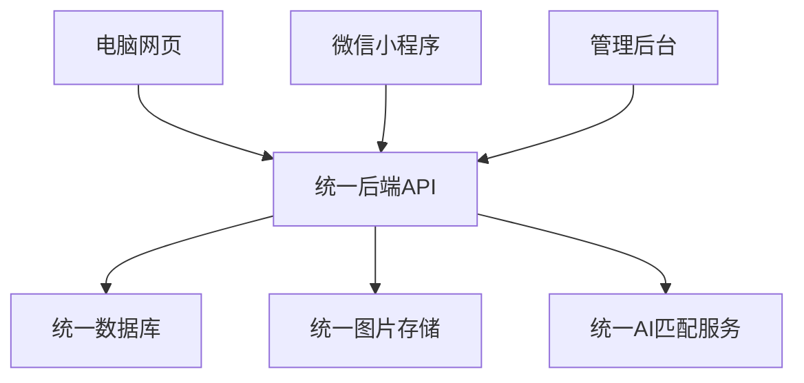
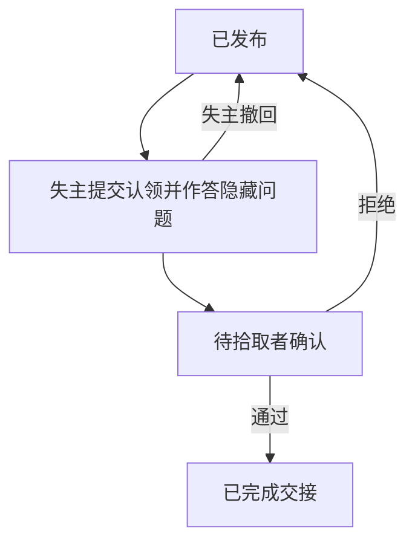
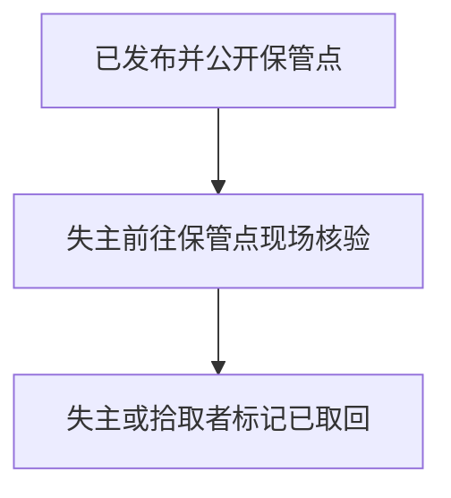

# AI 多模态失物招领平台：技术路径大纲

> 本文用于持续记录讨论后已经确定的技术决策。未讨论清楚的内容标记为“待定”，避免将建议误写成最终决定。

## 一、项目目标

- 建设一个面向社会公众的失物招领平台，可先从学校场景试点，再扩展到商场、车站、公园和社区等场所。
- 同时提供电脑网页和微信小程序。
- 两端共用后端、数据库、图片存储和 AI 匹配能力，数据实时互通。
- 使用云端 AI 服务实现文字搜图片、图片搜图片以及图文联合搜索。
- 已有资源：2 核 4G、60G 云服务器和一个域名。

## 二、已确定的客户端路线

### 1. 电脑网页

- 单独设计电脑端页面，不直接使用小程序页面布局。
- 前端技术暂定为 `Vue 3 + TypeScript`。
- 页面可以采用宽屏列表、左右分栏、大图预览等适合电脑浏览器的设计。

### 2. 微信小程序

- 单独设计适合手机操作的页面。
- 前端技术暂定为 `uni-app + Vue 3 + TypeScript`。
- 使用底部导航、单列信息流、拍照上传、微信登录和订阅消息等小程序能力。
- uni-app 主要用于开发微信小程序，不强求由同一份页面代码生成电脑网页。

### 3. 数据互通方式

电脑网页和微信小程序不直接互相同步，而是共同访问统一的后端 API：

### 4. 用户身份

- 系统使用内部统一的 `user_id` 标识用户。
- 手机号是网页和微信小程序共用的唯一登录标识。
- 网页端与微信小程序使用同一套账号体系，支持手机号加密码登录。
- 注册：手机号加短信验证码，同时设置密码。
- 日常登录：手机号加密码，不发短信，可显著降低短信开销。
- 忘记密码：通过短信验证码重置。
- 同时保留“手机号加验证码”作为备用登录方式。
- 密码使用 Django 内置哈希存储，禁止明文或可逆加密；登录失败次数与验证码发送频率都要限制。
- 短信验证码使用阿里云号码认证服务（PNVS）下的“短信认证”，个人实名账号即可开通，免企业资质与签名报备。
- 不依赖微信手机号快捷验证组件，因为该组件仅对非个人主体开放；若日后取得单位主体，可作为小程序端的可选优化。
- 验证码发送与校验均由后端完成，不能信任前端直接提交的号码。
- 后端按手机号查找或创建 `user_id`，再将小程序 `openid` 绑定到该用户，因此两端无需执行账号合并。
- 游客可以浏览和搜索；发布、收藏、认领等写操作需要完成手机号登录。
- 帖子、收藏、匹配和认领记录只关联内部 `user_id`，不直接依赖微信 `openid`。

### 5. 身份认证与认领门槛

- 拾取者采用低门槛准入，基础登录后即可发布捡到信息。
- 身份认证重点放在“发起认领”环节，而不是限制用户浏览或发布丢失信息。
- 目标形态：发起认领前必须通过身份证二要素核验，即核验姓名与身份证号是否一致。
- 该能力受主体资质限制，腾讯云与阿里云的实人认证均面向企业客户，个人实名账号无法开通，因此能否启用取决于单位主体是否落实。
- 代码中按可开关的能力实现：接口与认证等级字段先建好，主体落实后开启，未落实时走降级流程。
- 平台只保存认证状态、认证时间、服务商和认证流水号，原则上不保存身份证照片。
- 身份认证不能单独证明物品归属，认领时仍需隐藏特征问答、历史照片、购买记录或序列号等所有权证据。
- 未启用实名核验期间，个人保管物品的认领依靠所有权举证与拾取者判定，并优先引导移交官方保管点，该流程本身不依赖实名核验。
- 活体人脸认证暂不接入，保留为贵重物品或争议认领场景的后续升级能力。

### 6. 后端框架

- 统一使用 `Python + Django + Django REST Framework`。
- Django 负责用户、帖子、认领、举报、权限、数据库迁移和统一业务 API。
- 使用 Django Admin 作为首版管理后台，减少单独开发管理系统的工作量。
- AI 调用仍使用 Python，并通过后台任务执行，避免阻塞用户发布和搜索。
- 首版采用单体后端，不拆分微服务；后续只有在实际性能或团队协作需要出现后，再考虑将 AI 匹配服务独立出来。

### 7. 地理位置与场所标签

- 平台不按学校进行数据硬隔离，学校与商场、车站、公园、社区一样作为场所标签。
- 发布捡到信息时，可在用户授权后获取当前经纬度，并通过地图服务逆地理编码，自动生成省、市、区标签。
- “省/市/区”采用地图服务提供的标准行政区编码保存，不能只保存容易重名的文本。
- 更下一级的学校、商场等场所由拾取者从附近地点中自由选择，也允许搜索或手动补充场所名称。
- 分别记录“发现地点”和“物品当前保管地点”：发现地点用于匹配；保管地点属于敏感信息，只在认领通过后按需要向双方披露。
- 后端可以保存用于距离计算的准确坐标，但公开列表、地图和搜索结果只能展示模糊位置，例如场所名称或经过降精度处理的区域。
- 用户拒绝定位授权时仍可手动选择省、市、区和场所，不能把定位权限设为发布功能的唯一入口。
- 搜索默认优先同一场所和附近区域，结果不足时由用户主动扩大到区、市或更大范围。
- 首版数据库保存经纬度、行政区编码和场所记录；距离筛选先使用边界框与候选集距离计算，数据规模扩大后再考虑引入 PostGIS。

### 8. 云服务商

- 基础设施主要使用腾讯云：云服务器、对象存储 COS、域名解析。
- 短信验证码使用阿里云号码认证服务（PNVS）的短信认证，个人主体即可开通；腾讯云国内短信因个人主体无法报备签名而不采用。
- 身份证二要素核验待单位主体落实后再选定供应商。
- 地图能力使用腾讯位置服务，负责定位、逆地理编码、行政区划和附近场所搜索。
- AI 多模态向量暂定使用阿里云百炼，原因是其多模态 Embedding 支持较低维度（例如 512/768），更适合 2 核 4G 服务器的内存和索引压力。
- AI 调用通过统一的向量服务封装层接入，保留切换到腾讯云多模态向量模型的可能，不在业务代码中直接写死某一家供应商。
- 服务器位于中国大陆，域名需要完成 ICP 备案后才能对外提供服务，小程序也要求使用备案且启用 HTTPS 的域名。

## 三、主体资质约束（关键前置条件）

以下能力不由技术难度决定，而由账号主体资质决定，必须在开发前确认：

- 微信小程序“手机号快速验证组件”仅对完成微信认证的非个人主体小程序开放，个人主体无法使用。
- 该组件标准情况下按次收费；若小程序微信认证主体为政府、非营利组织，或类目为学历教育（学校）等特定情形，则不收费。
- 腾讯云国内短信自 2025 年 9 月 18 日起不再支持个人认证账号新增自用资质，个人账号需取得企事业单位授权的“他用”资质才能申请签名。
- 腾讯云人脸核身及实名信息核验（含身份证二要素接口 `IdCardVerification`）要求账号完成企业实名认证，个人实名账号无法开通。
- 腾讯位置服务个人开发者默认额度约为每日 1 万次、并发 5 次每秒，可满足试点；企业或非公益组织长期商业使用需要办理商业授权。

需要特别说明：以上限制属于监管与主体资质要求，不能通过付费或声明公益用途绕过。

### 已解决：手机号登录

采用阿里云号码认证服务（PNVS）下的“短信认证”，见[个人开发者接入指南](https://help.aliyun.com/zh/pnvs/use-cases/sms-verify-for-individual-developers)。

- 个人实名认证账号即可开通，无需企业营业执照，无需申请签名与模板。
- 平台提供预置签名与验证码模板，只能通过 API 调用，不支持自定义模板。
- 参考价格约每条四五分钱，试点规模成本可忽略。
- 重要限制：该服务只能发送验证码，不能发送通知类短信。因此“有新匹配”等提醒只能走站内信与小程序订阅消息，不能依赖短信。

### 高风险：小程序主体类型与 UGC 类目

失物招领属于用户生成内容（UGC）场景：用户自行发布物品信息并互相留言。

- 微信[备案服务内容标识选择指引](https://developers.weixin.qq.com/miniprogram/product/record/record_review.html)中，“社区/论坛”与“笔记”类目对个人主体标注为“不建议选择”，仅非个人主体“可选”。
- 微信[平台运营规范](https://developers.weixin.qq.com/minigame/product/) 5.7.1 规定，个人主体提供的服务超出个人主体开放类目范围属于违规，平台将限期整改，逾期未改可封禁能力直至下架。
- 因此以个人主体提交本小程序，存在审核不通过或上线后被下架的实质风险。
- 同类限制也影响网页侧：个人 ICP 备案的网站开展论坛社区类交互服务同样受限。

当前决定：接受该风险。

- 优先交付网页版，网页版作为项目主体与答辩演示对象。
- 微信小程序仍以个人主体提交，若因类目问题被下架则放弃小程序端，不影响网页版运行。
- 因此小程序端不承载独有功能，所有核心能力必须在网页端完整可用。
- 域名 ICP 备案已提交审核。需确认备案填报的服务内容与实际的信息发布场景一致，避免后续抽查时出现内容与备案不符的问题。
- 若后续希望消除该风险，可再考虑注册个体工商户或取得单位主体，两者都能解开小程序 UGC 类目、企业实名与实名核验三项限制。

### 未解决：身份证二要素核验

- 腾讯云人脸核身与实名信息核验要求企业实名认证；阿里云实人认证同样面向企业客户。个人主体没有等价替代方案。
- 因此该能力设计为可开关：先建好接口与认证等级字段，主体落实后开启。

结论：仍建议争取学校、学院或指导单位等事业单位主体，用于开通实名核验，并让小程序具备使用微信手机号快捷验证组件的条件。

当前决定：登录按阿里云短信认证实现，不再等待主体；认领的实名核验作为可开关能力，主体未落实前走下方降级方案。

如暂时无法取得单位主体，采用降级方案：

- 登录不受影响，网页与小程序均使用阿里云短信认证。
- 认领环节暂不接入身份证二要素，改为所有权举证加人工审核，并建议在学校保卫处、物业或前台等公共场所完成交接。
- 代码中仍预留二要素认证接口与认证等级字段，待主体资质落实后开启。
- 通知统一走站内信与小程序订阅消息，不依赖短信。

## 四、建议共享的前端资源

电脑网页与小程序页面分别实现，但可以共享：

- 后端 API 数据结构和接口说明。
- TypeScript 类型定义。
- 分类、帖子状态、认领状态等常量。
- 表单字段和基础校验规则。
- 色彩、字体、图标等视觉规范。

不要求共享：

- 具体页面组件。
- 页面布局。
- 浏览器与微信平台专属交互。

## 五、AI 匹配路线评估

### 1. 不采用“多角度拍照生成 3D 模型再转向量”

- 失主一侧通常没有丢失物品的多角度照片，很多情况下只有文字描述或一张旧照片，因此拾取方即使建出 3D 模型，检索一侧也没有可对齐的输入。
- 3D 重建对手机随手拍摄的质量、光照和背景很敏感，透明、反光、深色和纹理稀疏的物品失败率高，而这些恰好是常见丢失物。
- 2 核 4G 服务器无法本地运行重建模型，只能调用云端图生 3D 服务，单次费用和耗时都明显高于向量化，不适合每条帖子都执行。
- 3D 模型缺少成熟通用的检索表征，落地效果通常不如图文向量。
- 失物的判别信息主要是类别、颜色、品牌、文字与标识、贴纸、磨损痕迹和内部物品，属于外观与属性特征；而黑色手机、黑色钱包、无线耳机等物品的几何形状高度相似，3D 反而缺乏区分度。
- 关于“3D 能否向下兼容 2D”：技术上可以从 3D 模型渲染出任意视角的 2D 图，但渲染图属于合成图像，与真实照片存在差异，检索效果一般不如直接使用原始照片。更关键的是 3D 的信息来源就是那几张照片，重建再渲染不会带来新信息，反而容易在纹理、文字和标识上产生损失，而这些正是判别关键。因此 3D 在本场景属于有损的中间环节，不是增益。

### 2. 采用的方案

- 多模态向量作为召回主力，但不作为唯一判据。
- 已确定采用多视图向量：保留“多角度拍照”的产品设计，为每张图片分别生成向量，检索时取与查询最相似的一张作为该帖子的得分，而不是重建 3D。
- 使用多模态大模型对图片做结构化属性抽取，例如类别、主色、品牌与文字、显著特征，并生成规范化描述文本，用于属性过滤、关键词召回和匹配理由展示。
- 最终检索采用混合召回：结构化属性与地点、时间硬过滤，向量与关键词并行召回，再按规则重排。

### 3. 效果预期与验证方式

- 图搜图在双方都有照片时效果较好；纯文字搜图对细粒度品牌和型号识别能力有限，因此必须配合属性过滤与关键词。
- 向量维度优先选择较低维度以控制内存与索引开销，具体维度需结合评测结果确定。
- 必须建立固定评测集，统计 Recall@5、误报率、响应时间和单次成本，不能凭个别演示案例判断效果。

### 4. 向量维度与索引

- 默认维度 512，评测时同时跑一组 768 做对比，用数据决定是否切换。
- 试点规模下 512 与 768 的内存差异很小。以 1 万条帖子、每条 3 张图计算，共约 3 万条向量，512 维约 60MB，768 维约 90MB，不构成选型依据。
- 真正的差异出现在建索引时。数据量在十万条向量以内先不建 HNSW，使用精确检索即可满足延迟要求；超过该量级再建索引，届时低维度的内存优势才明显。
- 向量按 `provider / model / dim / version` 版本化存储，切换维度只需重算一次，不影响历史数据。

### 5. 排序初始权重

上线前不做参数调优，先用下列初始值，再用真实反馈校准：

| 因子 | 初始权重 |
| --- | --- |
| 向量相似度 | 0.55 |
| 二级分类相同 | 0.15 |
| 时间接近 | 0.10 |
| 场所相同 | 0.10 |
| 颜色或品牌一致 | 0.10 |

评测集规模不少于 100 组匿名正负样本，观测 Recall@5、误报率、单次搜寻耗时和单次 AI 成本。缺少评测集就无法判断向量检索是否真的有效。

### 6. 检索与所有权的区别

- 失主通常只能找到同型号的官方图或网络图，而不是自己那一件物品的照片。同型号照片对“是不是我的那一件”几乎没有判别力，照片越多也不能解决所有权问题。
- 因此检索的目标只是把候选范围缩小到少量结果，所有权判定必须依靠隐藏特征问答、独有特征（划痕、贴纸、刻字、保护壳、挂绳）、内部物品、序列号和购买凭证。
- 产品设计上要提醒拾取者在公开描述中保留一到两个关键细节，避免冒领者直接照抄描述回答问题。

## 六、成本结构

- AI 向量化本身成本极低。以阿里云百炼多模态 Embedding 为例，`tongyi-embedding-vision-flash` 单价约 `0.00015 元/千输入 Token`，默认分辨率档位下单张图片约 400 Token，即约 `0.00006 元/张`，一万张图片约 0.6 元。参见[百炼多模态 Embedding 文档](https://help.aliyun.com/zh/model-studio/multimodal-embedding-api-reference)。
- 使用多模态大模型做属性抽取的成本高于纯向量化，但仍属可控范围，具体取决于所选模型与输出长度，需在评测阶段实测。
- 真正的主要支出是短信、身份证二要素核验（约 `0.3 元/次`）、云服务器、带宽与对象存储流量，而不是 AI 调用。
- 各云厂商的“免费”通常是新用户限时限量额度，不是长期免费。例如[阿里云百炼新人免费额度](https://help.aliyun.com/zh/model-studio/new-free-quota)为每个模型约 100 万 Token、有效期 90 天，到期或耗尽后按量计费。
- 华为云等厂商面向高校提供扶持计划与学生认证优惠，但多数需要以学校或院系为单位申请，或通过评审，属于争取资源的途径，不能作为架构假设。
- 因此建议：用免费额度完成开发与评测阶段，正式上线按量付费，并同步申请高校或公益扶持；同时通过统一封装层保证可切换供应商，不把架构绑定在某一家的免费政策上。
- 必须设置调用频率限制、失败重试上限和用量监控，避免刷接口导致费用异常。

## 七、当前整体技术组合

- 电脑网页：`Vue 3 + TypeScript`
- 微信小程序：`uni-app + Vue 3 + TypeScript`
- 后端：`Python + Django + Django REST Framework`
- 首版管理后台：`Django Admin`
- 数据库候选：`PostgreSQL + pgvector`
- 异步任务候选：`Redis + RQ`
- 图片存储：腾讯云对象存储 `COS`
- 地图与位置：腾讯位置服务
- 短信验证码：阿里云号码认证服务 PNVS 短信认证，个人主体可用，仅限验证码
- 实名核验：待单位主体落实后接入，作为可开关能力
- AI 多模态向量：阿里云百炼多模态 Embedding，通过统一封装层调用
- 部署：腾讯云服务器运行业务服务，图片、地图、AI 和实名核验均使用云服务

数据库、异步任务和部署细节仍需进一步讨论后才能视为最终决定。

## 八、数据模型与沟通机制

### 1. 核心数据表

| 表 | 用途 |
| --- | --- |
| `users` | 用户：手机号、`openid`、认证等级、账号状态 |
| `id_verifications` | 身份证二要素核验记录：结果、时间、服务商与流水号，不保存身份证照片 |
| `regions` | 行政区：省市区标准编码 |
| `places` | 场所：学校、商场、车站等，关联 `regions` |
| `posts` | 帖子：类型、状态、分类、描述、时间区间、地点 |
| `post_images` | 图片：COS 路径、顺序、审核状态 |
| `image_embeddings` | 每张图片一条向量记录，含供应商、模型、维度和版本 |
| `post_attributes` | 结构化属性：颜色、品牌、文字标识、显著特征 |
| `match_candidates` | AI 候选匹配：双方帖子、得分、理由、用户反馈 |
| `claims` | 认领申请与状态机 |
| `claim_questions` | 隐藏特征问答的题目、答案与作答记录 |
| `messages` | 帖子下的直接聊天记录 |
| `blocks` | 用户拉黑关系 |
| `reports` | 举报记录 |
| `audit_logs` | 敏感操作审计 |

### 2. 关键约定

- 帖子状态使用枚举，例如 `草稿 / 已发布 / 认领中 / 已完成 / 已关闭`，不用多个布尔字段拼装状态。
- 帖子同时保存自由文本描述与结构化属性：文本用于展示和关键词召回，属性用于过滤与排序。
- 地点区分“发现地点”和“保管地点”，保管地点默认不可见。
- 向量单独建表，一个帖子多张图对应多条向量，检索时取最相似的一张作为该帖子的得分。
- pgvector 的向量维度在建表时固定，因此必须保存模型与维度信息，并允许同一张图片存在多个版本的向量，便于更换模型时平滑迁移。
- 隐藏特征问答的答案不得明文存储；仅存哈希只能支持完全匹配，实际答案措辞差异较大，采用加密存储并由拾取者判定，模型只能辅助提示，不得自动放行。

### 3. 分类体系

- 采用固定二级分类，例如“电子设备 / 手机”“证件 / 学生证”，并保留“其他”兜底。
- 选择“证件”大类时，发布页必须展示醒目提醒：建议立即移交公安机关或官方失物招领处，不要在平台公开证件正面照片；平台只履行提醒义务，不强制拦截发布。
- 证件类匹配以文字描述和分类为主，不依赖清晰人像或证件号照片。
- 在固定分类之外允许补充自由标签，用于检索和后续分类体系优化，但不作为硬过滤条件。
- 用户选择证件类（身份证、学生证、银行卡、驾驶证等）时，发布页必须弹出醒目提醒：建议立即移交公安机关或官方失物招领处，不要在平台上传清晰证件照，不要在公开描述中写出完整证件号。平台履行提醒义务，不强制拦截发布。

### 4. 沟通渠道

把“沟通”和“认领确认”分开：聊天开放，交接归属仍靠所有权举证。

- 沟通默认开放：登录用户可在帖子下与拾取者或失主直接聊天。
- 支持拉黑与举报；被拉黑后对方无法继续发消息。
- 允许用户自行在聊天中提供手机号、微信号等联系方式，风险自负；平台首次给出风险提示，不强制屏蔽。
- 聊天开放不等于认领通过：个人保管物品是否“确认交接”，仍由拾取者依据隐藏特征问答判定。
- 发起认领仍需完成身份证二要素认证，保证纠纷时可追溯。
- 官方保管物品地址已公开，聊天仅用于询问补充细节，不存在“确认解锁”这一步。
- 聊天记录、拉黑、举报、认领状态变更均写入 `audit_logs`，作为纠纷与治理依据。
- 平台仅识别并提示明显的诈骗或辱骂内容，不承诺拦截全部私下交易风险。

### 5. 移交官方

- 官方指学校保卫处、商场失物招领处、派出所等物品保管点。平台不发明取件码，现场认领仍按保管点原有办法办理。
- 拾取者发布时，系统提示将物品移交官方保管点。
- 一旦标记为已移交官方：保管点名称和地址从一开始就公开，失主无需等待任何人批准即可前往。
- 此类帖子不走“拾取者审问答并判定归属”。所有权核验发生在保管点现场。
- 拾取者仍可保留站内沟通入口，供失主询问补充细节；这不解锁拾取者手机号，也不构成认领批准。
- 个人保管与官方保管是两条流程：个人保管才需要认领问答与拾取者确认。

### 5.1 认领状态机

个人保管（拾取者自己保管物品）：

- 全程双方可在帖子下直接聊天，聊天不改变认领状态。
- 通过后帖子转为已完成；双方任一方标记已取回即归档。

官方保管（已移交保管点）：

- 没有“待确认”和“解锁联系方式”环节，所有权核验在保管点现场完成。
- 聊天仅用于询问细节，不作为放行依据。

### 6. 匹配触发方式

当前采用“失主按需搜寻 + 候选结果保留”，平台不做全库自动匹配。

- 拾取者只需发布捡到信息；系统在图片向量化完成后写入索引。
- 失主可以随时发起搜寻。每次搜寻先走硬过滤，再做向量与关键词召回。
- 搜寻结果写入 `match_candidates` 并保留。用户点过“不是这个”的候选下次仍会出现，但打上“曾标记为不匹配”标签。
- 失主可在自己的丢失帖子上自行开启定时匹配，例如每天一次。定时任务只对该帖子复用已有向量，套用与手动搜寻相同的硬过滤，有新候选时通知；默认关闭。
- 未发帖的临时搜寻仍然支持，查询向量可短期缓存。
- 平台不主动对所有用户做事件驱动通知。

### 7. 搜寻前的硬过滤

向量检索之前先用数据库条件缩小候选集，避免全库比向量。默认硬过滤如下：

| 条件 | 规则 | 是否可放宽 |
| --- | --- | --- |
| 帖子类型 | 只匹配相反类型：丢失对捡到 | 不可放宽 |
| 帖子状态 | 仅 `已发布` 或 `认领中`，排除草稿、已完成、已关闭 | 不可放宽 |
| 一级分类 | 同一大类才进入召回；任一方为“其他”时不按分类卡死 | 用户可选择“不限分类” |
| 时间窗 | 捡到时间应落在丢失时间附近，默认丢失日前 1 天至丢失日后 30 天 | 用户可扩大时间范围 |
| 地理范围 | 默认同一区或同一场所周边；结果不足时由用户扩大到市 | 用户可扩大，系统不自动扩到全国 |

硬过滤之后才做向量召回和关键词召回。颜色、品牌、二级分类、场所是否相同不用于剔除，只用于排序加分。

默认排序依据：向量相似度、一级分类已命中、二级分类是否相同、时间接近程度、场所是否相同、颜色或品牌是否一致。权重待评测后校准，不把综合分宣传成概率。

### 8. 管理分层

- 首版只做平台管理员，使用 Django Admin 处理帖子、认领、举报和用户封禁。
- 后期采用两层：平台管理员、场所管理员。场所管理员只能处理本场所帖子、认领和举报，例如某学校保卫处或某商场失物招领处。
- 不做按省市区切分的复杂租户体系。行政区只用于检索过滤，不作为独立管理组织。

### 9. 图片上传

目标：图片不经过 2 核 4G 服务器中转，避免占满带宽和 Django 进程。

推荐方案：前端先压缩，再直传腾讯云 COS。

1. 前端将图片压到约 1280 边长、单张不超过 2MB，最多 4 张。
2. 向后端申请一次性上传凭证，有效期约 5 分钟，路径由后端指定。
3. 网页或小程序把文件直接传到 COS。
4. COS 回调或前端回报对象键后，后端校验对象是否存在、大小和类型，再写入 `post_images`，并提交内容审核与向量化任务。
5. 原图进私有桶，对外只发短时签名 URL；列表使用缩略图。

该方案会多一次“申请凭证”的短请求，通常几十毫秒。真正传文件走的是 COS，不经过业务服务器，用户侧总耗时通常更短，服务器更不容易被上传堵住。

备选方案：前端压缩后传到 Django，再由后端写入 COS。实现更简单，也方便在入库前做文件头校验。并发一高，图片会占满 2 核 4G 的带宽和 worker，只适合极早期联调，不作为上线方案。

不采用：把原图长期放在云服务器本地磁盘。

## 九、部署方案

服务器只跑业务，不跑模型。图片在 COS，AI、地图、短信、实名核验都在云端。

### 1. 服务清单

使用 Docker Compose 部署以下服务：

| 服务 | 说明 |
| --- | --- |
| Nginx | HTTPS、域名、静态网页、上传大小限制、基础限流 |
| Django API | 首版 1 个进程 |
| Worker | 首版 1 个进程，负责向量化、内容审核、定时匹配 |
| PostgreSQL + pgvector | 业务数据与向量 |
| Redis | 任务队列、缓存、验证码频率限制 |

### 2. 内存分配

4G 内存的大致预算：

| 用途 | 预算 |
| --- | --- |
| 系统预留 | 约 0.5G |
| PostgreSQL | 约 1.5G |
| Redis | 约 0.3G |
| Django 与 Worker | 约 1.2G |
| 突发余量 | 其余 |

API 与 Worker 都不要开多进程，否则 4G 会立刻打满。

### 3. 安全与运维

- PostgreSQL 与 Redis 不暴露公网端口，仅容器内网访问。
- 60G 磁盘主要留给数据库、日志和备份缓存；日志按天轮转。
- 数据库每日备份到 COS，并定期做恢复演练，只备份不恢复等于没有备份。
- 大陆服务器需先完成 ICP 备案，小程序才能使用该域名。
- 云 API 密钥通过环境变量注入，不进入代码仓库。

### 4. 扩容顺序

出现瓶颈时按此顺序处理，不在首版引入 Kubernetes 或 Elasticsearch：

1. 图片访问慢：接 CDN。
2. 数据库吃紧：先加内存，再考虑迁移到托管 PostgreSQL。
3. 队列积压：增加 Worker 或迁移到云队列。

## 十、MVP 定义与上线前置条件

### 1. MVP 是什么

MVP 指功能最少、但核心链路完整可用的第一个真实版本。它不是演示 demo，也不是半成品：范围可以小，但必须真实部署在正式域名上，陌生用户能注册、发布、搜索并完成归还。

| 对比项 | MVP | 完整成品 |
| --- | --- | --- |
| 功能范围 | 只覆盖一条核心链路 | 覆盖各类场景与边缘情况 |
| 是否上线 | 必须上线给真实用户使用 | 同样上线 |
| 质量要求 | 核心链路稳定、不泄露数据 | 同样，另加体验打磨与性能优化 |
| 目的 | 验证匹配是否有效、是否有人使用 | 规模化运营 |

核心链路：拾取者发布物品，失主搜索命中，双方确认，物品归还。链路中缺任一环，MVP 不成立。

### 2. MVP 功能范围

纳入 MVP：

- 手机号注册登录，密码与验证码两种方式
- 发布捡到与丢失信息，图片直传 COS
- 图片与文本向量化
- 手动搜寻，硬过滤加向量与关键词混合召回
- AI 候选结果与匹配理由展示
- 认领问答与拾取者确认
- 帖子下直接聊天、拉黑、举报
- 移交官方保管点标记与公开展示
- Django Admin 管理后台

MVP 之后再做：

- 定时匹配与订阅消息通知
- 场所管理员分层
- 身份证二要素核验（取决于主体资质）
- 数据统计与运营看板

#### v0：一周冲刺版范围（实际团队分工见下文“团队分工”一节）

实际开发团队为 6 人，多数无 Django 或 Vue 直接经验，目标是一周内把网页版做到能真实跑通一遍核心链路。v0 在上述 MVP 基础上再收窄，是阶段性交付，不是放弃后续项：

| 事项 | v0 处理方式 | 何时补齐 |
| --- | --- | --- |
| 帖子下直接聊天 | 直接砍掉。认领通过后，改为展示双方预留联系方式 | 一周之后作为独立迭代加回 |
| 隐藏特征问答答案存储 | 先明文存储，接口不对外返回答案内容，只返回作答结果 | 一周后接入加密存储，属于补丁而非新功能 |
| 短信验证码 | 接入阿里云 PNVS 真实短信，但联调限时半天；半天内跑不通就先用固定验证码占位，真短信作为并行任务继续推进，不卡主链路 | 半天内未通即转为并行任务，不设新截止时间，但不能拖过 v0 走查 |
| 图片与向量检索 | 按原计划做完整多视图向量检索，不降级为关键词优先。这是团队内风险最高的单点任务，由负责人自行判断进度，若确认来不及必须提前一天报告并降级为硬过滤加关键词，不能拖到最后一天才暴露 | 若 v0 降级，一周后补回多视图向量 |
| 评测集 | 规模降到 20 至 30 组，只验证“有没有效”，不追求统计显著性 | 一周后扩到 100 至 300 组 |
| 移交官方保管点批量导入 | 不做批量导入，只保留字段与标记能力，真实数据后续补录 | 冷启动阶段视人力再启动 |
| 微信小程序 | 本轮不做，只交付网页版 | 网页版稳定后再排期 |

### 3. 交付顺序

1. 先交付网页版，作为项目主体与答辩演示对象，核心能力必须在网页端完整可用。
2. 网页版稳定后再做微信小程序，小程序不承载独有功能。
3. 小程序若因个人主体的 UGC 类目问题未过审或被下架，直接放弃该端，不影响整体交付。

### 4. 上线前置条件

以下事项属于关键路径，必须在第一周启动，不能等代码写完再办：

- ICP 备案：已提交审核。备案通过前不得通过该域名对外提供网站服务。
- 小程序账号与类目：以个人主体注册，类目风险已知并接受。
- 用户发布内容的平台对内容安全有强制要求。MVP 先做举报入口与管理员人工审核，内容安全 API 作为可开关能力预留。

### 5. 团队分工

#### 5.1 实际团队构成与一周冲刺分工

以下取代此前基于假设人员（A 至 F）的通用规划，按团队实际背景重新分工，目标是一周内交付网页版 v0（范围见前文“v0：一周冲刺版范围”表）。团队共 7 人，6 人写代码，1 人为法学专业只做法律文本，不计入开发人数。冷启动与评测集不设专门非开发人手，分别由团队自行想办法与由 AI 负责人兼任。

下文任务分配一律用代号指代，不再重复写背景：

| 代号 | 背景 |
| --- | --- |
| A | 叶建新|
| B | 李子骞|信息安全
| C | 赵悦 |信息安全
| D | 车艾佳 |物联网工程
| E | 孙文博|
| F | 涂美灵 |
| G（非开发） | 吴娴越|法学，只做隐私政策与用户协议，不参与代码 |

本轮改动：A 是数据模型与帖子接口是所有人依赖的最前置部分，适合交给通用编程能力最强的人，让它尽早稳定，而不是留在前端画页面。A 调走后前端只剩 D、F 两人，为此把原来“搜索结果页、认领问答页”分别并入 D 的搜索模块和 F 的详情页，不再单独立项，见下表。

| 代号 | 本轮任务 |
| --- | --- |
| A | 数据模型与迁移、帖子接口（含硬过滤查询逻辑）、接口契约定稿。这是所有人依赖的前置部分，第一天必须先把字段和路径冻结下来，其余实现可以慢 |
| B | 账号鉴权（短信验证码接入）、图片上传签名凭证接口、部署（Docker、Nginx、HTTPS）、限流等安全基线、Django Admin |
| C | 认领状态机、认领问答接口、权限基线。字段与状态流转第一天需要和 A 对齐，避免认领和帖子两张表出现耦合冲突 |
| D | 前端：发布页（表单、图片直传交互、上传进度与失败重试）、搜索结果页（候选展示、匹配理由、“不是这个”标记）。第一天上午额外负责把 Vue 3 + TS 项目脚手架与路由骨架搭起来（建议直接用 Element Plus 或 Ant Design Vue，不自绘组件） |
| E | AI 封装层（图片与文本向量化、多视图向量检索）、评测集建设、整体联调与技术把关。这是本轮风险最高的单点任务，见下方风险控制 |
| F | 视觉规范（色彩、字体、间距）、登录注册页、列表页、详情页（含认领问答，做成详情页内的模块而不是独立页面，减少一个页面骨架）。内容对接由 A 或 C 在联调阶段协助补齐字段 |

分工原则：

- 一个后端模块只由一人负责，不出现两人同时改同一张表或同一组接口。
- 前端只剩 D、F 两人，共用同一套骨架，各自只改自己目录下的页面文件，避免初学 Vue 的成员在 git 冲突上耗时间。骨架本身工作量不小，且是唯一的公共依赖，建议 A 在第一天上午先抽出一小时和 D 结对搭起来再回后端，比 D 单独摸索更快出结果。
- 一周冲刺不设正式的按目录审查流程，改为每天结束前 15 分钟站会对齐进度与接口变化，优先保证不互相阻塞，而不是走完整评审。
- 接口契约（字段、路径、返回结构）第一天定稿，定稿后前端立刻基于 mock 数据开工，不等后端实现完成。

#### 5.2 一周节奏

| 时间 | 重点 |
| --- | --- |
| 第 1 天 | A 牵头、C 配合冻结接口契约与数据模型字段；A 抽一小时帮 D 搭好 Vue 骨架与路由后回后端；B 推进短信联调；F 出关键页面视觉稿；E 打通向量化 API 的最小 demo |
| 第 2 至 3 天 | A、B、C 并行实现各自后端模块；D、F 对着 mock 并行写页面；E 推进多视图向量检索与检索接口 |
| 第 4 天 | 前后端开始联调，用真实接口替换 mock，优先打通“登录 → 发布 → 搜索”这条主链路；认领问答不阻塞这一步 |
| 第 5 天 | 联调认领问答与确认流程；补齐未登录跳转、上传失败提示、搜索无结果等边界情况；开始部署到服务器 |
| 第 6 天 | 完整走查一次核心链路（发布 → 搜索命中 → 认领 → 归还标记）；跑一次 20 至 30 组评测集，判断向量检索是否有效 |
| 第 7 天 | 缓冲日：只修 bug、不加新功能；准备演示与答辩材料 |

#### 5.3 风险控制

- AI 向量检索是本轮唯一坚持不降级的高风险项：若 E 确认进度跟不上，必须在第 4 天前主动报告并降级为硬过滤加关键词召回，不能拖到第 6 天走查时才暴露，因为那样会拖累整条核心链路的验证。
- 短信验证码联调限时半天，半天内跑不通就先用固定验证码占位，真实短信由 B 作为并行任务继续推进，不卡登录这条主链路。
- 详情页与列表页归 F 负责，但精确坐标、保管地点、对方手机号等敏感字段必须由 A 在帖子接口层裁剪掉，不下发到前端，不依赖前端不去渲染。
- 图片统一通过 B 提供的签名凭证接口获取上传地址与访问链接，前端不得自行拼接对象存储路径。
- 隐藏特征问答本轮先明文存储、接口不对外返回答案内容，加密存储作为一周后的补丁，不在本轮范围内。
- 聊天功能本轮不做，认领通过后改为展示双方预留联系方式；不影响核心链路验证。
- D、F 只有两人却要覆盖五个页面，是本轮除 AI 检索外第二大风险点。若第 3 天结束时页面明显跟不上，优先砍视觉细节保交互，必要时由 A 或 E 抽时间接手一页，不要让两人硬扛到第 6 天。
- 若某人当天卡住超过半天，第一时间在站会说明，由 A 或 E 协调支援，不要独自消化到影响联调。

主体确认、备案在第一周同步启动，不等开发进度；冷启动与法律文本按团队现有安排推进，不在本文档展开。

### 6. 运营规则

#### 证件类物品

- 选择证件分类时，强制展示提醒：建议移交公安机关或官方失物招领处，不要上传未打码的证件正面照。
- 平台只履行提醒义务，不因未移交而禁止发帖。
- 公开描述中不应出现完整证件号、姓名等；这些信息只应出现在认领问答或现场核验中。

#### 内容审核

腾讯云图片/文本内容安全个人实名账号可开通，账户余额大于 0 即可，后付费约 25 元/万张或万条，新用户有 3000 次、15 天试用。见[图片内容安全开通说明](https://cloud.tencent.com/document/product/1125/37109)。阿里云内容安全 1.0 需企业认证，不采用。

当前决定：MVP 先不接内容安全 API。上线最低配置为：

- 用户举报入口
- 管理员可下架帖子、删除聊天、封禁账号
- 代码预留审核接口，后续可打开

该决定会提高平台对用户发布内容的责任风险，尤其在个人备案站点上。若上线后出现投诉或监管抽查，应立即打开腾讯云内容安全。

#### 数据保留

| 数据 | 保留规则 |
| --- | --- |
| 未完结帖子 | 发布后 90 天自动关闭；关闭前 7 天通知发帖人 |
| 已完成或已关闭帖子 | 再保留 30 天，随后删除 COS 原图与向量，仅保留匿名统计字段 |
| 聊天记录 | 随帖子删除，额外保留 7 天供纠纷查阅 |
| 精确坐标 | 仅服务端用于距离计算，帖子删除时一并删除 |
| 账号注销 | 删除手机号绑定与草稿；未完结帖子关闭；已完成帖子作者匿名化 |
| 审计日志 | 保留 180 天 |
| 数据库备份 | 每日备份到 COS，保留 7 天 |

#### 恶意行为

MVP 不做专门的反作弊产品。登录验证码与接口频率限制仍保留，作为安全基线。其余刷帖、虚假认领、骚扰由平台管理员人工封禁。

#### 冷启动

优先联系学校保卫处、商场或社区官方失物招领处，在取得对方同意后批量录入已有招领信息。

- 导入帖子一律标记为已移交官方，保管点地址公开。
- 通过 Django Admin 或 CSV 导入，不走普通用户发布流程。
- 必须有书面或邮件授权，不能擅自爬取或偷拍官方公告栏。

隐私政策与用户协议由组内法学生起草。开发组需提供数据清单：收集哪些字段、用于什么、保存多久、是否出境。

#### 认领纠纷

平台不做物权裁判，不判定物品所有权。

- 同一件个人保管物品出现多名认领人时，管理员暂停该帖，通知拾取者。
- 由拾取者依据隐藏特征问答决定交给谁；若物品已在官方保管点，由现场保管点按原有办法处理。
- 平台最多提供聊天记录与问答记录供参考，不代替任何一方做归属决定。
- 管理员可关闭明显恶意的重复认领，但不宣布“谁是失主”。

## 十一、待讨论事项

技术路径主体已定。落地前只需跟进，不再阻塞架构：

1. 官方失物招领处批量导入的授权与字段模板。
2. 开发组向法学生提供的数据清单是否齐全。
3. ICP 备案结果与小程序类目实际审核结果。

## 十二、名词说明

- `uni-app`：使用 Vue 风格代码开发小程序、H5 和 App 等客户端的跨平台框架。
- `H5`：国内开发语境通常指适合手机浏览器访问的移动网页。
- `API`：前端访问后端数据和功能的统一接口。
- `openid`：微信为同一小程序内的用户分配的身份标识，不能代替平台内部统一用户 ID。
- `COS`：腾讯云对象存储，用于保存用户上传的图片。
- `ICP 备案`：在中国大陆通过域名对外提供网站服务需要完成的备案手续。
- `逆地理编码`：把经纬度坐标转换为省、市、区和地点名称的服务。
- `二要素核验`：核验姓名与身份证号是否真实且一致，不涉及人脸。

