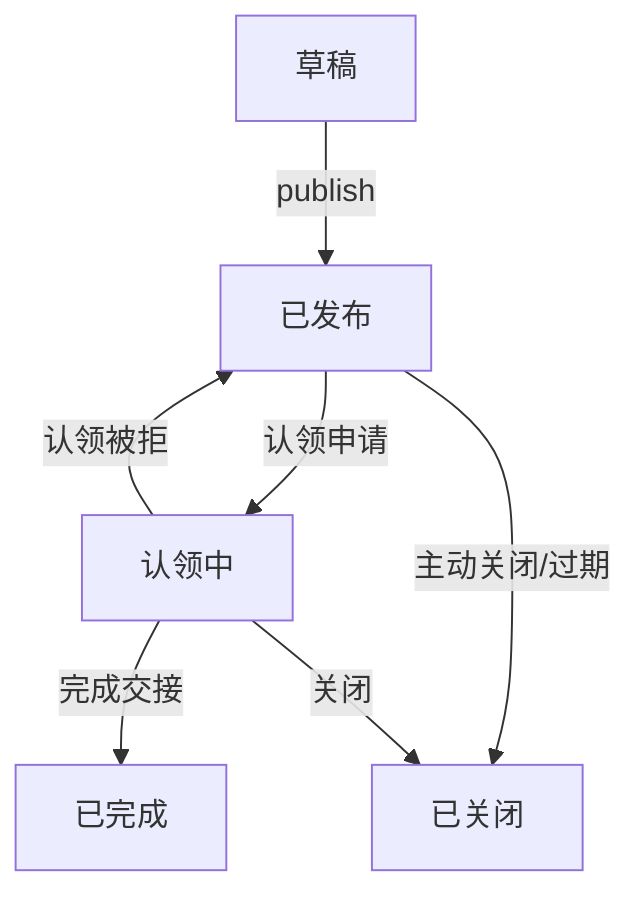

# 帖子接口契约（Day 1 冻结稿）

> 冻结范围：字段、路径、请求/响应结构、枚举值和硬过滤规则。实现细节可以在联调中修，但字段名和返回结构不再随意改。

## 1. 基础约定

- Base URL：`/api/v1`
- 认证：写操作需登录；浏览、搜索允许游客访问。
- 时间格式：ISO 8601，后端统一输出 UTC，前端本地化展示。
- 分页：列表接口返回 `page` / `page_size` / `count` / `results`。
- 图片：前端不得拼接 COS 路径；`url` 由后端签发短时签名 URL（联调时接入 B 的凭证服务）。

## 2. 枚举值

### 2.1 帖子类型 `type`

| 值 | 含义 |
| --- | --- |
| `lost` | 丢失 |
| `found` | 捡到 |

### 2.2 帖子状态 `status`

| 值 | 含义 | 说明 |
| --- | --- | --- |
| `draft` | 草稿 | 未公开 |
| `published` | 已发布 | 可被搜索命中 |
| `claiming` | 认领中 | 有人发起认领，仍可被搜索命中 |
| `completed` | 已完成 | 交接完成，不可再认领 |
| `closed` | 已关闭 | 过期或主动关闭，不可被搜索命中 |

状态流转（帖子侧，认领侧由 C 对齐）：



### 2.3 分类 `category_l1` / `category_l2`

一级分类和二级分类都用稳定的英文代码，前端展示中文 label：

| category_l1 | 中文 | category_l2 示例 |
| --- | --- | --- |
| `electronics` | 电子设备 | `phone` 手机、`laptop` 笔记本电脑、`tablet` 平板、`headphones` 耳机、`other_electronics` |
| `documents` | 证件 | `id_card` 身份证、`student_id` 学生证、`bank_card` 银行卡、`driver_license` 驾驶证、`other_documents` |
| `bags` | 包袋 | `backpack` 双肩包、`wallet` 钱包、`handbag` 手提包、`other_bags` |
| `clothing` | 衣物 | `jacket` 外套、`scarf` 围巾、`other_clothing` |
| `accessories` | 饰品 | `watch` 手表、`glasses` 眼镜、`jewelry` 首饰、`other_accessories` |
| `stationery` | 文具 | `book` 书籍、`stationery_box` 文具盒、`other_stationery` |
| `keys` | 钥匙与门禁 | `keys` 钥匙、`access_card` 门禁卡、`other_keys` |
| `other` | 其他 | `other` |

### 2.4 保管方式 `custody_type`

| 值 | 含义 |
| --- | --- |
| `personal` | 个人保管 |
| `official` | 官方保管 |

### 2.5 图片审核状态 `review_status`

| 值 | 含义 |
| --- | --- |
| `pending` | 待审核 |
| `approved` | 通过 |
| `rejected` | 拒绝 |

## 3. 帖子资源

### 3.1 公开字段（所有客户端可见）

| 字段 | 类型 | 说明 |
| --- | --- | --- |
| `id` | integer | 帖子 ID |
| `type` | string | `lost` / `found` |
| `status` | string | 见 2.2 |
| `category_l1` | string | 一级分类代码 |
| `category_l2` | string | 二级分类代码 |
| `category_l1_label` | string | 一级分类中文 |
| `category_l2_label` | string | 二级分类中文 |
| `title` | string \| null | 标题，可空 |
| `description` | string | 自由文本描述 |
| `found_region` | object \| null | `{code, name}` 发现行政区 |
| `found_place` | object \| null | `{id, name, place_type}` 发现场所，只返回名称级别 |
| `custody_type` | string | `personal` / `official` |
| `event_start_at` | string \| null | 时间窗口起点 |
| `event_end_at` | string \| null | 时间窗口终点 |
| `published_at` | string \| null | 发布时间 |
| `created_at` | string | 创建时间 |
| `updated_at` | string | 更新时间 |
| `images` | array | `[{id, sort_order, review_status, url}]` |
| `attribute` | object \| null | AI 结构化属性，见 3.2 |

以下字段属于敏感信息，**任何公开帖子接口都不得返回**：

- `found_location_lat` / `found_location_lng`：精确坐标，仅服务端距离计算用。
- `custody_place` 完整对象、`custody_address`：保管地点，认领通过后按需要向双方披露，列表和详情不下发。
- 对方手机号等联系方式：只可能由 C 的认领流程在通过后单独下发，不属于帖子接口。

### 3.2 AI 结构化属性 `attribute`

| 字段 | 类型 | 说明 |
| --- | --- | --- |
| `brand` | string \| null | 品牌 |
| `primary_color` | string \| null | 主色 |
| `text_mark` | string \| null | 文字标识 |
| `distinctive_features` | string \| null | 显著特征 |
| `normalized_description` | string \| null | 规范化描述 |

### 3.3 列表查询 `GET /api/v1/posts`

公开接口，游客可访问。默认只返回 `published` 和 `claiming` 状态的帖子，草稿、已完成、已关闭不返回。

查询参数：

| 参数 | 类型 | 说明 | 默认 |
| --- | --- | --- | --- |
| `type` | string | `lost` / `found` | 不限 |
| `category_l1` | string | 一级分类，`any` 表示不限 | 不限 |
| `category_l2` | string | 二级分类 | 不限 |
| `region_code` | string | 行政区代码，建议传区县级 | 不限 |
| `place_id` | integer | 场所 ID | 不限 |
| `event_start` | datetime | 时间窗口起点 | 不限 |
| `event_end` | datetime | 时间窗口终点 | 不限 |
| `q` | string | 关键词，先做文本/属性匹配 | 无 |
| `page` | integer | 页码，从 1 开始 | 1 |
| `page_size` | integer | 每页条数，最大 50 | 20 |

硬过滤顺序（先缩小候选集，再交给 E 做向量与关键词召回）：

1. `type`：精确过滤。
2. `status`：只允许 `published` / `claiming`，不可通过参数放宽。
3. `category_l1`：`any` 或为空时不卡；给定值且不是 `other` 时精确过滤。
4. 时间窗：返回的帖子事件区间与 `[event_start, event_end]` 有交集。
5. 地理：`region_code` 精确过滤；`place_id` 精确过滤。

颜色、品牌、二级分类、场所是否相同只用于排序加分，不用于剔除。

响应：

```json
{
  "count": 2,
  "page": 1,
  "page_size": 20,
  "results": [
    {
      "id": 1,
      "type": "found",
      "status": "published",
      "category_l1": "electronics",
      "category_l2": "phone",
      "category_l1_label": "电子设备",
      "category_l2_label": "手机",
      "title": null,
      "description": "图书馆三楼捡到一部黑色手机，请失主联系。",
      "found_region": {"code": "440305", "name": "南山区"},
      "found_place": {"id": 12, "name": "图书馆", "place_type": "school"},
      "custody_type": "personal",
      "event_start_at": "2026-08-18T02:30:00Z",
      "event_end_at": "2026-08-18T03:00:00Z",
      "published_at": "2026-08-18T03:05:00Z",
      "created_at": "2026-08-18T03:05:00Z",
      "updated_at": "2026-08-18T03:05:00Z",
      "images": [
        {
          "id": 101,
          "sort_order": 0,
          "review_status": "pending",
          "url": "https://example.com/signed-url"
        }
      ],
      "attribute": {
        "brand": null,
        "primary_color": "黑色",
        "text_mark": null,
        "distinctive_features": null,
        "normalized_description": "黑色手机"
      }
    }
  ]
}
```

### 3.4 详情 `GET /api/v1/posts/{id}`

公开接口。返回字段与 3.1 相同，仍不得返回精确坐标、保管地点、联系方式。

### 3.5 创建 `POST /api/v1/posts`

需登录。

请求体：

```json
{
  "type": "found",
  "category_l1": "electronics",
  "category_l2": "phone",
  "title": null,
  "description": "图书馆三楼捡到一部黑色手机。",
  "found_region_code": "440305",
  "found_place_id": 12,
  "found_location_lat": 22.5333,
  "found_location_lng": 113.9300,
  "custody_type": "personal",
  "custody_place_id": null,
  "custody_address": "",
  "event_start_at": "2026-08-18T02:30:00Z",
  "event_end_at": "2026-08-18T03:00:00Z",
  "images": [
    {"cos_key": "posts/2026/08/uuid.jpg", "sort_order": 0}
  ]
}
```

规则：

- `type`、`category_l1`、`category_l2`、`description`、`found_region_code`、`event_start_at`、`event_end_at` 必填。
- `images` 最多 4 张；`cos_key` 由 B 的直传凭证接口返回，A 的接口只负责落库，联调时增加 COS 对象存在性校验。
- 成功创建返回 201 和公开字段；敏感字段不回显。

### 3.6 更新 `PATCH /api/v1/posts/{id}`

需本人。仅允许更新自己帖子的可编辑字段：`title`、`description`、分类、地点、时间窗、图片、`custody_type` 等。已 `completed` / `closed` 的帖子不可再改。

### 3.7 发布 `POST /api/v1/posts/{id}/publish`

需本人。`draft` → `published`，并写入 `published_at`。

### 3.8 关闭 `POST /api/v1/posts/{id}/close`

需本人或管理员。状态改为 `closed`，之后不再被搜索命中。

## 4. 错误约定

统一返回：

```json
{
  "detail": "可读错误信息"
}
```

字段校验错误返回：

```json
{
  "field_name": ["错误信息"]
}
```

## 5. 给 E 的复用约定

E 的向量检索接口在召回前调用 `apps/posts/filters.py` 中的 `apply_post_hard_filters`，传入相同的硬过滤参数；向量和关键词召回只发生在硬过滤之后的候选集上，不在全库上跑。

